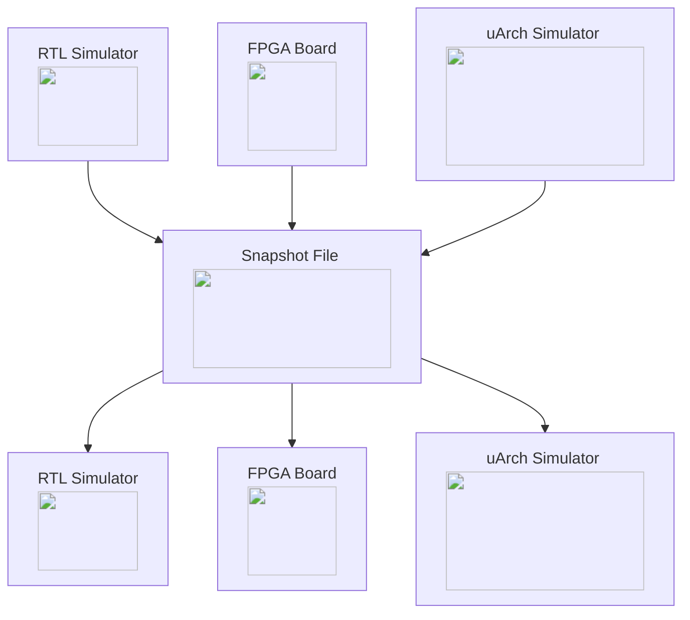
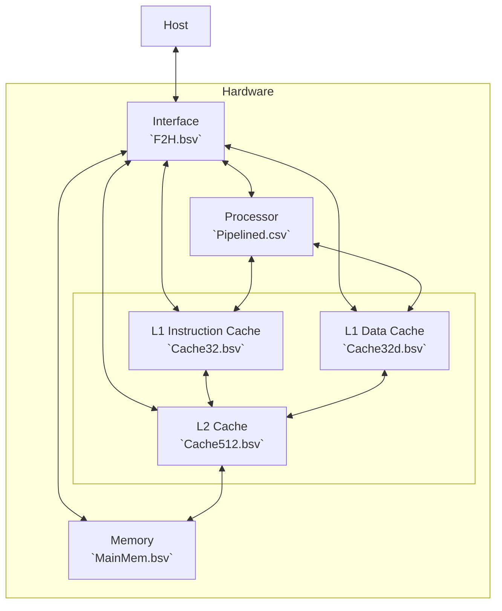

# Crossing the Line

This project contains a snapshotable in-order processor with configurable L1i, L1d, and L2 cache. 

Currently, the project offers the following features:
- Support for pausing execution in simulation or RTL
- RTL support for efficient checkpointing and transfer of microarchitectural state
- Support for developers to specify which microarchitectural states they are interested in checkpointing
- A small in-order 32-bit RISCV core with 2 levels of caches
- Support for running the core on an actual FPGA and interfacing with it
- Small microbenchmarks to test the implementation and design


This project is a course project of CS-629 (by Prof. Thomas Bourgeat) at EPFL, and a joint effort of the following contributors:
- Giorgio Ajmone
- Shanqing Lin
- Ayan Chakraborty


## Quick Start

#### Environment Setup

First, you need to install Bluespec and Bluespec contribe libraries. You can find the installation instructions:
- [Bluespec](https://github.com/B-Lang-org/bsc)
- [Bluespec Contrib](https://github.com/B-Lang-org/bsc-contrib)

Then, you need to install the Connectal framework, which provides the interface between the Bluespec hardware the the host machine. You can find the installation instructions [here](https://github.com/search?q=Connectal&type=repositories). 

If you are using a newer version of GCC, you need to turn off the `strict` mode in the Connectal Makefile, so that it does not treat all compilation warning as errors. Modify line 279 in the `Makefile.connectal` under the Connectal root directory with the `--nonstrict` flag as follows:

```makefile
    $(CONNECTALFLAGS) $(BSVFILES) $(GENTOP) $(PRINTF_EXTRA) $(VERBOSE_SWITCH) --nonstrict
```

Connectal is refereneced in the `Makefile` in the root directory of this project. You are strongly recommeded to modify the `CONNECTALDIR` variable to point to the Connectal root directory.

#### Compile

The project follows the same convention as the Connectal framework. 

To compile the project inside the simulator (e.g., Bluesim), simply run the following command:

```bash
make build.bluesim
```

You can also compile the project for the FPGA. We only test our design under a very low frequency (20MHz). To do that, run the following command:

```bash
make -f Makefile.fpga build.<fpga_name>
```

#### Workload Preparation

Before running, you need to prepare the memory content of the processor, i.e., the workload. We reuse the workload from the course, and you can find the them in the `workload` directory. 
To compile all workloads, go to the `test` directory under the `workload` directory, and run the following command:

```bash
make
```

To pick one workload to generate its DRAM content, go to its parent directory, and run the following command:

```bash
./test.sh <workload_name>32
```

It will generate `mem.vmh` and `memlines.vmh` files in the same directory. They contain the code and the data sections of the workload.

#### Run

You need to copy the `mem.vmh` and `memlines.vmh` files to the project folder, so that they can be loaded by the generated binary. You are also required to copy the `zero*.vmh` files from the `workload` directory to the project folder. They are used to initialize the BRAM used by the caches:

```bash
cp workloads/*.vmh .
```

To run the project, run the following command:

```bash
./"<bluesim or fpga_name>"/bin/ubuntu.exe
```

After the program is initialized, you should be able to see the prompt. Initially, the processor is halted. To run the workload you generated, simply type `r`.

#### Load and Save Snapshot

You can save the snapshot of the processor by typing `s` in the prompt, then the program will ask the path to put the snapshot json file. You can load the snapshot by typing `l`, then the program will ask the path to the snapshot json file. We provided some snapshot files in the `snapshots` directory for you to test.

## Motivation

<!--Why snapshotting the processor?-->
There are many benefits of snapshoting a processor. With the snapshot, the same program running on the processor can be restarted from various places, including a RTL simulator, a FPGA, a software uArch simulator, or the same design on a different platform. This is useful for debugging, testing, and performance evaluation, by combining the advantages of different platforms.



<!-- What to snapshot? -->
Our snapshot contains the complete software states (the software visible registers and the memory), and the cache hierarchy. We include the cache states in the snapshot because (1) they contain the data that is not the main memory, and (2) they are useful for creating checkpoints for [sampling-based microarchitectural simulation](https://web.eecs.umich.edu/~twenisch/papers/isca03.pdf). Other microachitectural states, if needed, can be added to the snapshot using the same interface suggested by the next section.

For more details, please reach out to our [presentation slides](doc/slide.pdf).

## Design

Stably snapshotting a processor requires the following steps:
- Halt the processor
- Wait for all transactions to complete, i.e., canonicalize
- Load / save the states

To achieve above, we need to:
- Add an interface to pause, canonicalize, and resume the processor, by interacting with a host machine
- Add or reuse existing hardware to access the states, including reading and writing




#### Interfaces

There are two types of interface: request and indication. The request interface defines the messages that are sent from the host to the hardware, while the indication interface defines the messages that are sent from the hardware to the host. Both interfaces are defined in the `F2H.bsv` file.

The request interface (`CoreRequest`) contains the following methods:
- Halt (`halt`) and restart (`restart`)
- Canonicalize (`canonicalize`)
- Access states (`request`)
- UART requests handling (`responseInUART` and `responseAvUART`)

The indication interface (`CoreIndication`) contains the following methods:
- Indication of the completion of the halt, restart, and canonicalize (`halted`, `restarted`, and `canonicalized`)
- Indication of the completion of state access (`response`)
- Proactive halting request from the hardware (`requestHalt`)
- UART and MMIO operations (`responseOutUART` and `responseAvUART`)


#### Halt and Canonicalization

As mentioned before, the reason for halting and canonicalizing the hardware before creating snapshots is to ensure that the hardware is in a consistent state. 

<!-- How is the halt method implemented? -->
The halt method is implemented by setting a flag in the processor (`doHalt`) to true. This flag prohibits all the rules that are related for executing instructions. Note that memory hierarchy is not halted, because we still need it in order to successfully drain the pipeline.

<!-- How is the canonicalization implemented? -->
Canonicalization can be only called after the processor is halted. It sets the flag (`doCanonicalize`), which started the decode, execute, and the write back stage in order to finish the instructions in the middle of execution. After all instructions are piped, the processor sends halt request to the cache hierarchy, and set up the `isCanonicalized` flag to true. 

Both halt and canonicalize methods call their corresponding indication methods to notify the host that the processor is halted or canonicalized. 

#### State Access

<!-- How states are accessed?  -->
All states to snapshot are accessed through the `request` and the `response` methods. The `request` method has four parameters:
- The operation, it can be read or write.
- The component ID, indicating which component the state belongs to. It can be processor (0), L1i (1), L1d (2), L2 (3), or memory (4).
- The address, meaning a specific position of that component. This is interpreted differently for different components. 
- The data, which is the data to be written to the address. The data is ignored if the operation is read.
The `response` method has one return value, which is the data read from the address, or the updated data if the operation is write.

<!-- How states are mapped to a specific address? -->
Addresses are used to access the states inside each component:
- The processor uses the address to access the register file. 0 is used for PC, and 1-32 are used for the general integer registers.
- The cache uses the address to access the tag array, the data, and the LRU bits. The last two bits of the address are used to control the data type.
    - 00: the LRU bits. The rest of the bits are interpreted as the set index.
    - 01: the tag array. The rest of the bits are interpreted as the set index and the way index.
    - 10: the data array. The rest of the bits are interpreted as the set index and the way index.
    - 11 is not used.
- The memory uses the address to access the memory array. The address is interpreted as the memory address.

<!-- State access also has indication methods -->
The state access methods also have their corresponding indication methods. The `response` method is called to return the data read from the address, or the updated data if the operation is write. The `response` method is called to notify the host that the state access is completed. 


#### Host Interaction

The interface wrapper code running the host is implemented in the `glue.cpp`. It contains the following logics:
- Wrapping and synchronizing the request and indication interfaces. It uses atomic counters as a semaphore to make sure that all operations are completed exclusively and in order.
- Handling the UART and MMIO operations. It reads the UART input and writes the UART output to the host. It also reads the MMIO input and writes the MMIO output to the host.
- Serilizing and deserializing the snapshot file. It reads the snapshot file and sends the states to the hardware. It also reads the states from the hardware and writes them to the snapshot file.
- Endianess handling. It converts the endianness of the states to the host endianness.


